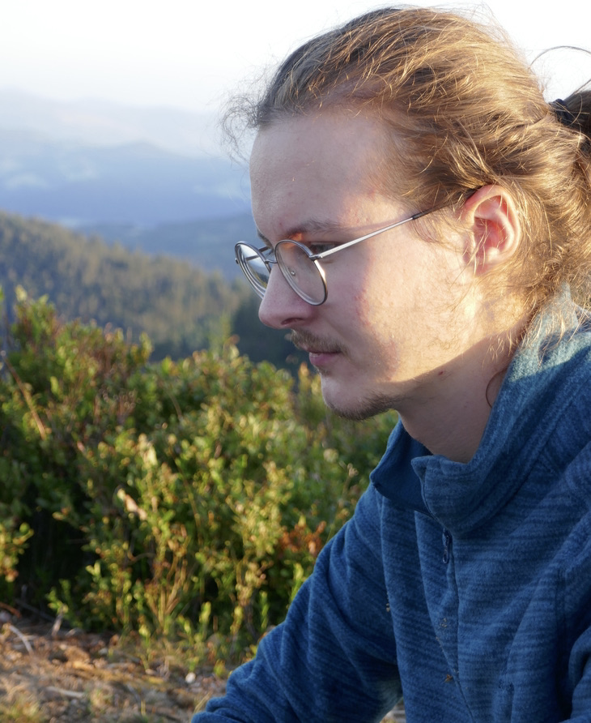

I’m a Ph.D. student at [INSA Lyon](https://www.insa-lyon.fr/), in the [Inria Beagle](https://team.inria.fr/beagle/) team.

Before that, I studied at the [École Normale Supérieure](https://www.ens.psl.eu) in Paris, where I obtained an M. Sc. in [theoretical computer science](https://wikimpri.dptinfo.ens-cachan.fr/doku.php), and an M. Sc. in [ecology and evolution](https://www.enseignement.biologie.ens.fr/spip.php?article193).

You can find my CV [here](./pdf/resume.pdf), follow me on [Twitter](https://twitter.com/tgrohens), or look at my code on [GitHub](https://github.com/tgrohens) and on the [Inria GitLab](https://gitlab.inria.fr/tgrohens).

You can reach me at `theotime (.) grohens (@) inria (.) fr`.

## Research interests

My current research interests focus on evolutionary biology, and especially mathematical and computational models of evolution.

The broad goal of my Ph.D. project is to gain a better understanding of how epistatic interactions between different kinds of mutations help shape evolutionary dynamics, and I am currently focusing on the coupling between DNA supercoiling and gene transcription.
In order to study this phenomenon under the light of evolution, I develop and use [EvoTSC](https://gitlab.inria.fr/tgrohens/evotsc), a simulation aimed at understanding how the transcription-supercoiling coupling can shape the genome over evolutionary timescales.

## Publications

### Computational Biology

* **_A Genome-Wide Evolutionary Simulation of the Transcription-Supercoiling Coupling_**.
**Théotime Grohens**, Sam Meyer, Guillaume Beslon, _ALIFE 2021_. ([hal](https://hal.archives-ouvertes.fr/hal-03242696), [doi](https://doi.org/10.1162/isal_a_00434), [pdf](./pdf/alife21.pdf))

### Covid-19

* **_Understanding and monitoring the evolution of the Covid-19 epidemic from medical emergency calls: the example of the Paris area_**.
Stéphane Gaubert, Marianne Akian, Xavier Allamigeon, Marin Boyet, Baptiste Colin, **Théotime Grohens**, Laurent Massoulié, David P. Parsons, Frédéric Adnet, Érick Chanzy, Laurent Goix, Frédéric Lapostolle, Éric Lecarpentier, Christophe Leroy, Thomas Loeb, Jean-Sébastien Marx, Caroline Télion, Laurent Tréluyer, Pierre Carli, _Comptes Rendus Mathématique_, 2020. ([doi](https://doi.org/10.5802/crmath.99), [pdf](./pdf/crm20.pdf))

### Programming Languages

* **_Symbolic Execution for JavaScript_**.
José Fragoso Santos, Petar Maksimovic, **Théotime Grohens**, Julian Dolby, Philippa Gardner, _Principles and Practice of Declarative Programming_, 2018. ([doi](https://doi.org/10.1145/3236950.3236956), [pdf](./pdf/ppdp18.pdf))

## Talks & Posters

* November 2021. [GDR BIM](https://www.gdr-bim.cnrs.fr/journees-du-gdr-bim-2021/), poster.
* November 2021. [CompSysBio winter school](https://project.inria.fr/compsysbio2021/), short talk and poster.
* July 2021. [ALIFE 2021](https://www.robot100.cz/alife2021/), Prague (virtual), short talk.
* November 2019. [GDR AIEM](https://aiem2019.sciencesconf.org/program), Toulouse, short talk.

## Teaching

I teach Computer Science at [INSA Lyon](https://www.insa-lyon.fr/), in the [Biosciences](https://biosciences.insa-lyon.fr/) and [Computer Science](https://if.insa-lyon.fr/) departments.

* In 2021-2022, I taught in the [Computer Science](https://if.insa-lyon.fr/fr/content/formation) track:
  * Introduction to C++ (TA, 16h)
  * Introduction to Parallel Programming (TA, 22h)

* In 2020-2021, I taught in the [Bioinformatics and Modeling](https://biosciences.insa-lyon.fr/fr/content/parcours-bioinformatique-et-modelisation) track:

  * Introduction to Theoretical Computer Science (12h)

  and in the [Computer Science](https://if.insa-lyon.fr/fr/content/formation) track:

  * Introduction to C++ (TA, 16h)
  * Introduction to Parallel Programming (TA, 22h)
  * Tutoring for last-year student projects (10h)

* In 2019-2020, I taught in the [Bioinformatics and Modeling](https://biosciences.insa-lyon.fr/fr/content/parcours-bioinformatique-et-modelisation) track:
  * Algorithms for Bioinformatics (10h)
  * Introduction to Theoretical Computer Science (12h)
