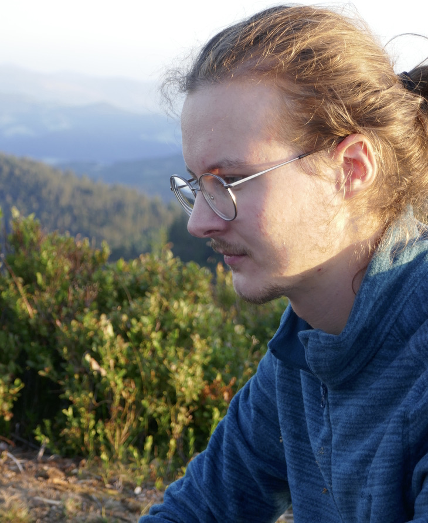

I’m a post-doctoral researcher in the [Comparative and Integrative Genomics of Organ Development (CIGOGNE)](https://www.ens-lyon.fr/LBMC/equipes/comparative-and-integrative-genomics-of-organ-development) team, at the [Laboratory of Biology and Modeling of the Cell](https://www.ens-lyon.fr/LBMC) at [ENS Lyon](https://www.ens-lyon.fr).

Before that, I did a first postdoc at the [Center for Genomic Regulation](https://www.crg.eu/) in Barcelona, in the [Weghorn lab](https://weghornlab.net/), after obtaining my Ph.D. at [INSA Lyon](https://www.insa-lyon.fr/) in the [Inria Beagle](https://team.inria.fr/beagle/) team.
Even before, I studied at the [École Normale Supérieure](https://www.ens.psl.eu) in Paris, where I obtained an M. Sc. in [theoretical computer science](https://mpri-master.ens.fr/doku.php) and an M. Sc. in [ecology and evolution](https://www.enseignement.biologie.ens.fr/spip.php?article193).

You can find my CV [here](./pdf/resume.pdf), follow me on [BlueSky](https://bsky.app/profile/tgrohens.bsky.social), or look at my code on [GitHub](https://github.com/tgrohens) and on the [Inria GitLab](https://gitlab.inria.fr/x-grohens).

You can reach me at `theotime (.) grohens (@) ens-lyon (.) fr`.

## Research interests

My research interests focus on evolutionary biology, and especially mathematical and computational models of evolution.

In the CIGOGNE team, I am currently working on elucidating the molecular mechanisms guiding the evolution of rodent tooth development.

During my postdoc at CRG, I worked on understanding the selection pressures that act upon cancer cells, and in particular on the interaction between cancer and the immune system.

During my PhD, I studied how epistatic interactions between different kinds of mutations help shape evolutionary dynamics, through the lens of the coupling between DNA supercoiling and gene transcription.
In order to study this phenomenon under the light of evolution, I developed and used [EvoTSC](https://gitlab.inria.fr/tgrohens/evotsc), a simulation aimed at understanding how the transcription-supercoiling coupling can shape bacterial genomes over evolutionary timescales.

## Publications

### Computational Biology

* **_Emergence of Supercoiling-Mediated Regulatory Networks through the Evolution of Bacterial Chromosome Organization_**.\
  **Théotime Grohens**, Sam Meyer, Guillaume Beslon.
  * Journal article: _PLOS Computational Biology_, 2025. ([doi](https://doi.org/10.1371/journal.pcbi.1013482), [pdf](./pdf/ploscb25.pdf))
  * Peer-reviewed preprint: _Peer Community in: Mathematical & Computational Biology_, 2024. ([doi](https://doi.org/10.24072/pci.mcb.100198), [pdf](./pdf/biorxiv2024.pdf))

* **_Forward-in-time simulation of chromosomal rearrangements: The invisible backbone that sustains long-term adaptation_**.\
  Paul Banse, Juliette Luiselli, David P. Parsons, **Théotime Grohens**, Marco Foley, Leonardo Trujillo, Jonathan Rouzaud-Cornabas, Carole Knibbe, Guillaume Beslon. _Molecular Ecology_, 2023. ([doi](https://doi.org/10.1111/mec.17234), [pdf](./pdf/molevol2023.pdf))

* **_A Genome-Wide Evolutionary Simulation of the Transcription-Supercoiling Coupling: extended version_**.\
  **Théotime Grohens**, Sam Meyer, Guillaume Beslon, _Artificial Life_, 2022. ([hal](https://hal.archives-ouvertes.fr/hal-03667822/), [doi](
https://doi.org/10.1162/artl_a_00373), [pdf](./pdf/artl22.pdf))

* **_A Genome-Wide Evolutionary Simulation of the Transcription-Supercoiling Coupling_**.\
  **Théotime Grohens**, Sam Meyer, Guillaume Beslon, _ALIFE 2021_, 2021. ([hal](https://hal.archives-ouvertes.fr/hal-03242696), [doi](https://doi.org/10.1162/isal_a_00434), [pdf](./pdf/alife21.pdf))

### Covid-19

* **_Understanding and monitoring the evolution of the Covid-19 epidemic from medical emergency calls: the example of the Paris area_**.\
  Stéphane Gaubert, Marianne Akian, Xavier Allamigeon, Marin Boyet, Baptiste Colin, **Théotime Grohens**, Laurent Massoulié, David P. Parsons, Frédéric Adnet, Érick Chanzy, Laurent Goix, Frédéric Lapostolle, Éric Lecarpentier, Christophe Leroy, Thomas Loeb, Jean-Sébastien Marx, Caroline Télion, Laurent Tréluyer, Pierre Carli, _Comptes Rendus Mathématique_, 2020. ([hal](https://hal.archives-ouvertes.fr/hal-02648075v2), [doi](https://doi.org/10.5802/crmath.99), [pdf](./pdf/crm20.pdf))

### Programming Languages

* **_Symbolic Execution for JavaScript_**.\
  José Fragoso Santos, Petar Maksimovic, **Théotime Grohens**, Julian Dolby, Philippa Gardner, _Principles and Practice of Declarative Programming_, 2018. ([doi](https://doi.org/10.1145/3236950.3236956), [pdf](./pdf/ppdp18.pdf))

### PhD Thesis

* **_Ride the Supercoiling: Evolution of Supercoiling-Mediated Gene Regulatory Networks through Genomic Inversions_**.\
  **Théotime Grohens**, 2022. ([hal](https://theses.hal.science/tel-04146510v1), [pdf](./pdf/phd.pdf))

## Talks & Posters

* July 2026. [JOBIM 2026](https://premc.org/jobim-2026), Strasbourg, short talk.
* June 2026. [EuroEvoDevo 2026](https://www.evodevoconference26.com/), Glasgow, poster.
* November 2025. [AIEM 2025](https://gdr-aiem-2025.sciencesconf.org/), Montpellier, short talk.
* August 2025. [ESEB 2025](https://eseb2025.com/), Barcelona, poster.
* November 2023. [ETEE 2023](https://etee2023.sciencesconf.org), Gif-sur-Yvette, short talk.
* July 2023. [SMBE 2023](https://www.smbe2023.org), Ferrara, poster.
* September 2022. [BioSyL](http://www.biosyl.org/news/biosyl-day), Lyon, short talk.
* November 2021. [GDR BIM](https://www.gdr-bim.cnrs.fr/journees-du-gdr-bim-2021/), Lyon, poster.
* November 2021. [CompSysBio winter school](https://project.inria.fr/compsysbio2021/), Aussois, short talk and poster.
* July 2021. [ALIFE 2021](https://www.robot100.cz/alife2021/), Prague (virtual), short talk.
* November 2019. [GDR AIEM](https://aiem2019.sciencesconf.org/program), Toulouse, short talk.

## Software

* [EvoTSC](https://gitlab.inria.fr/tgrohens/EvoTSC): EvoTSC is an individual-based evolutionary simulation based on a model of the transcription-supercoiling coupling that I developed during my PhD years.
* [Aevol](https://gitlab.inria.fr/aevol/aevol): Aevol is an _in silico_ experimental evolution platform, used to simulate populations of individuals with realistic genomes, the development of which I took part in during my PhD.
* A [blog post](https://v8.dev/blog/dataview) relating my internship work on the [V8 JavaScript engine](https://github.com/v8/v8) powering the Chrome browser.

## Teaching

During my PhD, I taught computer science at [INSA Lyon](https://www.insa-lyon.fr/), in the [Biosciences](https://biosciences.insa-lyon.fr/) and [Computer Science](https://if.insa-lyon.fr/) departments, and at [IUT Lyon 1](https://iut.univ-lyon1.fr/).
